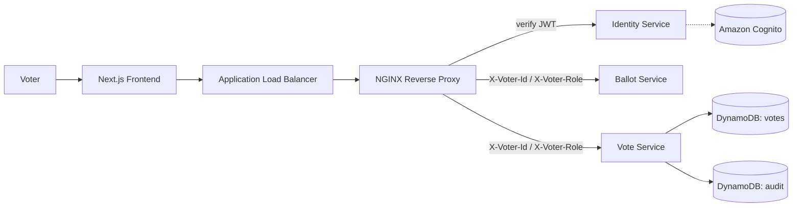

# 🗳️ Vote Inc.

**A verifiable e-voting platform built with Domain-Driven Design microservices on AWS.**

Digital voting has to keep two promises that pull against each other: voters must stay **anonymous**, and elections must stay **auditable**. This organisation hosts a proof of concept that explores whether a cloud-native architecture can deliver both at once.

> ⚠️ This is a research proof of concept, not a production electoral system. See [Limitations](#-limitations).

---

## 📦 Repositories

| Repository | Description | Stack |
|---|---|---|
| [`identity-service`](https://github.com/Vote-Inc/Identity) | Validates Cognito JWTs and forwards the voter's ID and role to downstream services as headers. | C# / .NET |
| [`ballot-service`](https://github.com/Vote-Inc/Ballot) | Serves active elections and full ballots with candidates. | C# / .NET |
| [`vote-service`](https://github.com/Vote-Inc/Vote) | Casts votes, prevents duplicates, writes the hash-chained audit ledger, and verifies receipts. | C# / .NET, DynamoDB |
| [`frontend`](https://github.com/Vote-Inc/improved-chainsaw) | Voter-facing web app: sign in, view elections, vote, and verify a receipt. | Next.js, TypeScript |
| [`infrastructure`](https://github.com/Vote-Inc/infra) | All AWS resources, defined in three dependency-ordered Terraform stacks. | Terraform |

---

## 🏗️ Architecture

Every service runs as a container on **Amazon ECS Fargate**. Every request passes through NGINX to the Identity Service first, so no other service ever handles JWT logic. Each bounded context knows as little as possible about the others, so no single component holds enough information to compromise an election.

---

## 🔁 How a vote works

1. **Sign in.** The voter authenticates with Amazon Cognito and receives a JWT.
2. **Gatekeeping.** The Identity Service validates the token and attaches the voter's ID and role as headers. Invalid requests get a `401`.
3. **View the ballot.** The Ballot Service returns active elections and candidates.
4. **Cast the vote.** The Vote Service hashes the voter ID with SHA-256 and writes the vote with an atomic conditional write.
5. **Get a receipt.** A hash-chained entry is appended to the audit ledger, and the voter receives a receipt ID.
6. **No double voting.** A second attempt returns `409 Conflict`. Nothing new is written.
7. **Verify.** `GET /api/votes/verify/{receiptId}` confirms the vote was recorded, without returning any voter identifier.

---

## 🔐 Key design decisions

**Hashed voter identity.** The repository hashes the voter ID with `Hash.Of()` at the persistence boundary, so only the `voterHash` ever reaches DynamoDB.

**Atomic duplicate prevention.** Votes are written with `ConditionExpression = "attribute_not_exists(voterHash)"`. DynamoDB checks and writes in one atomic operation, which removes the time-of-check/time-of-use race of a read-then-write approach.

**Hash-chained audit ledger.** Each audit entry stores the previous entry's hash (`prevHash`) and a SHA-256 of its own contents (`entryHash`). Altering any historical entry breaks every hash after it. Version numbers are written conditionally, so concurrent votes can't claim the same slot.

**Append-only through IAM.** The Vote Service's task role is granted only `dynamodb:PutItem` and `dynamodb:Query` on the audit table. Without `UpdateItem` or `DeleteItem`, even compromised application code can't rewrite history.

**Why not QLDB?** The original design used Amazon QLDB, which AWS deprecated during development. The ledger was rebuilt on DynamoDB with explicit hash chaining, which keeps the verification logic visible and auditable in the codebase.

---

## 🧰 Tech stack

- **Backend:** C# / .NET, Domain-Driven Design (aggregates, value objects, domain events, repositories)
- **Frontend:** Next.js (App Router), TypeScript
- **Cloud:** Amazon ECS Fargate, ECR, Application Load Balancer, VPC
- **Data:** Amazon DynamoDB (pay-per-request)
- **Auth:** Amazon Cognito, NGINX auth proxy
- **Infrastructure as code:** Terraform

---

## ⚠️ Limitations

- **Linkability.** SHA-256 is deterministic. Someone with a list of all eligible voter IDs could hash them and match them against stored records, revealing who voted and, from the audit table, how.
- **Voter and choice share a row.** This deliberately enables individual verification, at the cost of stronger anonymity.
- **Hardcoded elections.** The Ballot Service uses static election data instead of an admin service.

---

## 📄 Read more

- 📝 [Project write-up](https://jasonkitamirike.com/projects/cloud-native-distributed-voting-platform/)

Built by **Jason Kitamirike** · [Website](https://jasonkitamirike.com/) · [LinkedIn](https://www.linkedin.com/in/jason-kitamirike/)
